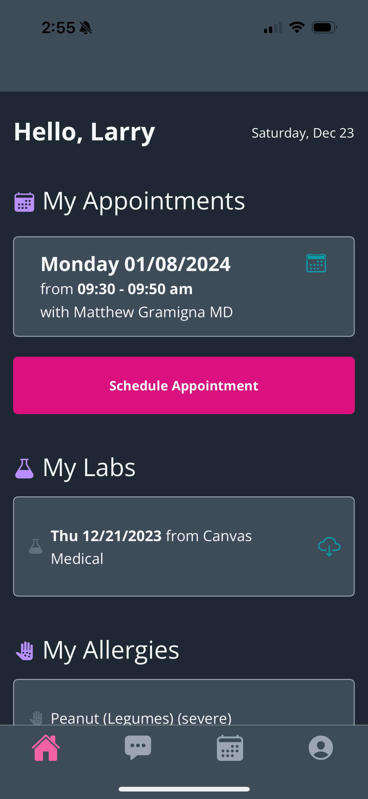
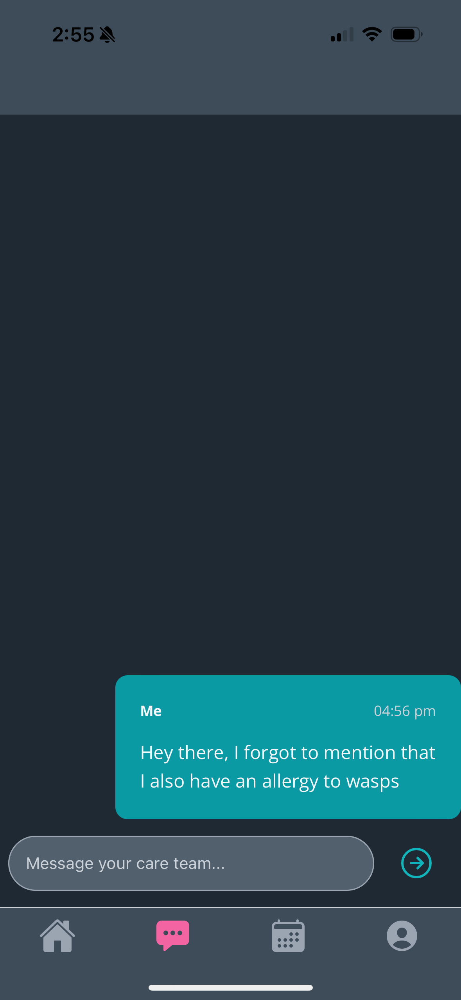
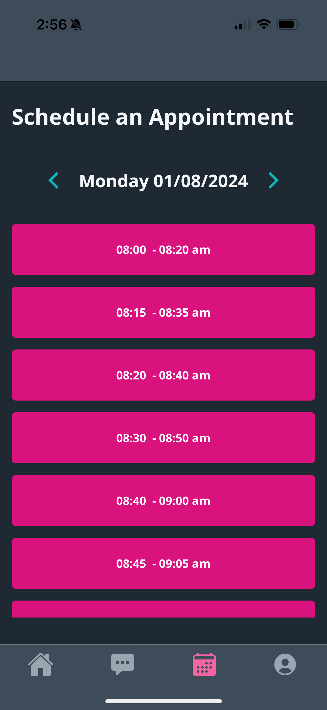
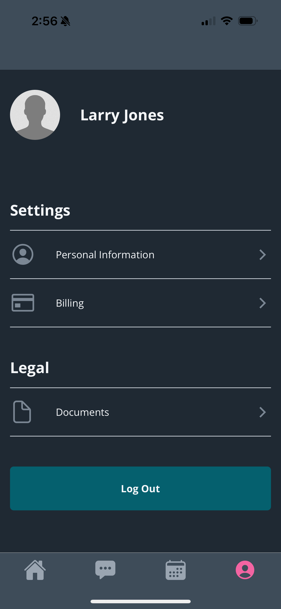
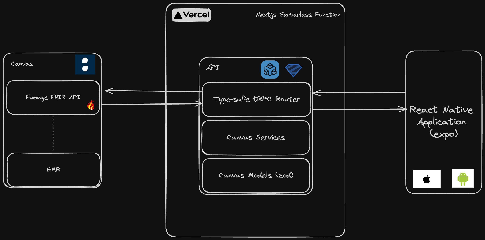

# Careforge

Submission for the [Canvas Medical FHIR API Challenge](https://www.canvasmedical.com/fhir-api-prize)

Careforge is a cross-platform mobile app allowing patients to take control of their health data by viewing their medical records, making appointments, and more.

<p align="center">
    
    
</p>
<p align="center">
    
    
</p>

## Architecture

Made with:

- [React Native](https://reactnative.dev/) + [Expo](https://docs.expo.dev/) + [Nativewind](https://www.nativewind.dev/)
- [tRPC](https://trpc.io/) + [Zod](https://zod.dev)
- [Nextjs](https://nextjs.org/) serverless API routes
- [Turborepo](https://turbo.build/repo) + [pnpm](https://pnpm.io/) monorepo organization, dependency management, and task orchestration



## Development Setup

### Prerequisites

- [Node.js](https://nodejs.org/en) >=18.18.2
- [pnpm](https://pnpm.io/)
- iOS or Android device or simulator with [Expo Go](https://expo.dev/client)

### Setup

1. Rename `.env.example` to `.env` and fill in the necessary secrets for connecting to your Canvas FHIR API and EMR (see [Canvas' docs](https://docs.canvasmedical.com/api/customer-authentication/) for more detail).
2. Run `pnpm install` from the root
3. Run `pnpm dev` from the root
4. Open the Expo Go app to load the React Native application on your device

### Navigating the Codebase

```
.
├── apps
│   ├── expo
│   │   └── src
│   │       ├── app        --> app screens using expo-router
│   │       ├── components --> React components used throughout the app
│   │       ├── fhirpath   --> fhirpath helpers for extracting strings from FHIR resources
│   │       ├── theme      --> Color palette used from tailwind config
│   │       └── ...
│   └── nextjs             --> Nextjs serverless API handlers
├── packages
│   ├── api
│   │   └── src
│   │       ├── router     --> tRPC routers for each FHIR resource
│   │       └── ...
│   └── canvas
│       └── src
│           ├── models     --> Zod Schemas/TypeScript types for each FHIR Resource
│           ├── services   --> Services for each FHIR resource
│           └── ...
└── tooling
    ├── eslint             --> Shared eslint config
    ├── github             --> GitHub actions/CI utils
    ├── prettier           --> Shared prettier config
    ├── tailwind           --> Shared tailwind config
    └── typescript         --> Shared TypeScript config
```

### Testing

1. Run the model transformation unit tests with `pnpm -F canvas test`
2. Lint the codebase with `pnpm lint`
3. Typecheck the codebase with `pnpm typecheck`
